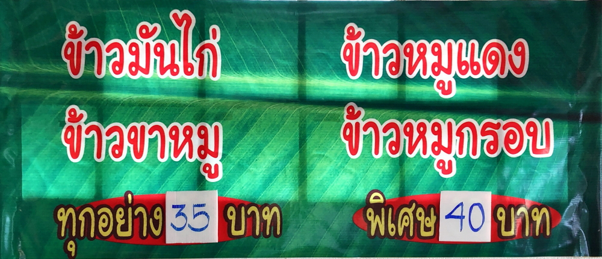

# whooneimaloy

<html lang="th">
 <head>
  <meta charset="utf-8" />
 

<link href="https://cdnjs.cloudflare.com/ajax/libs/lightbox2/2.7.1/css/lightbox.css" rel="stylesheet">
 
</head>
<!--
<body onload="alert('ゴーさん、お疲れ様でした。またやりましょう！')" onunload="alert('再会の時まで、元気でお過ごしくださいませ〜(^o^)/')">
-->

ร้านอิ่มอร่อย

<h1><marquee behavior="lrft">!!! 2562/04/10@ร้านอิ่มอร่อย!!!</marquee></h1>

<marquee direction="right" scrollamount="10" width="80%">TEL:087-177-8052</marquee>

     

  ← QR_code

<h3>↓ 2019/04/10</h3>

                          

                          

Map

<iframe src="https://www.google.com/maps/embed?pb=!1m14!1m12!1m3!1d6749.551409725878!2d99.90368987001816!3d20.19446459486639!2m3!1f0!2f0!3f0!3m2!1i1024!2i768!4f13.1!5e0!3m2!1sja!2sth!4v1554882432460!5m2!1sja!2sth" width="600" height="450" frameborder="0" style="border:0" allowfullscreen></iframe>

<!-- フッタ -->
 <footer>
 Copyright 2019/04/10 Mibu.Torokoid
</footer>
